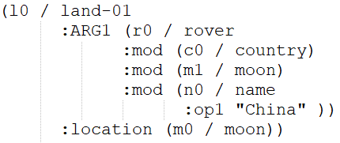
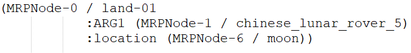
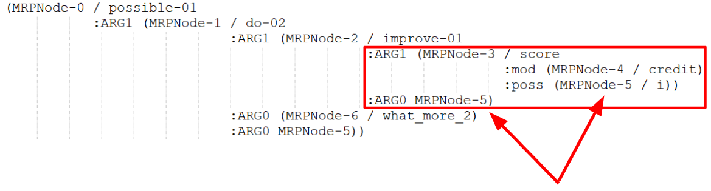
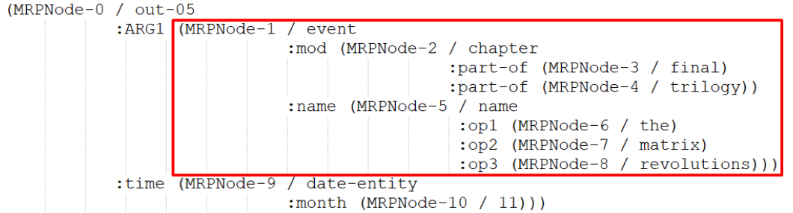
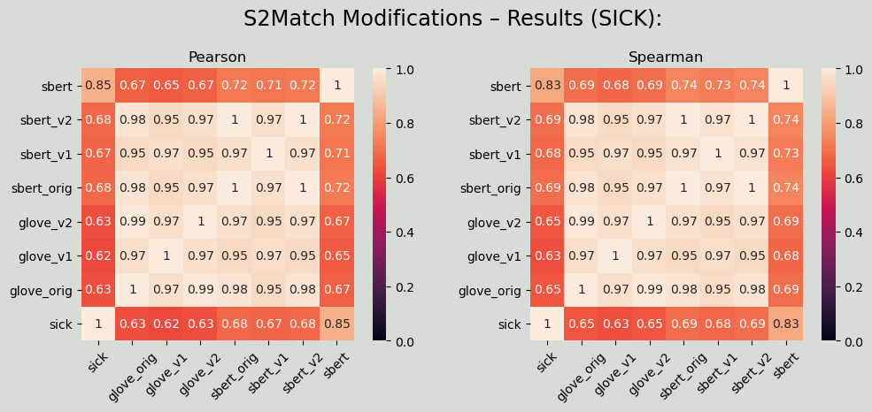
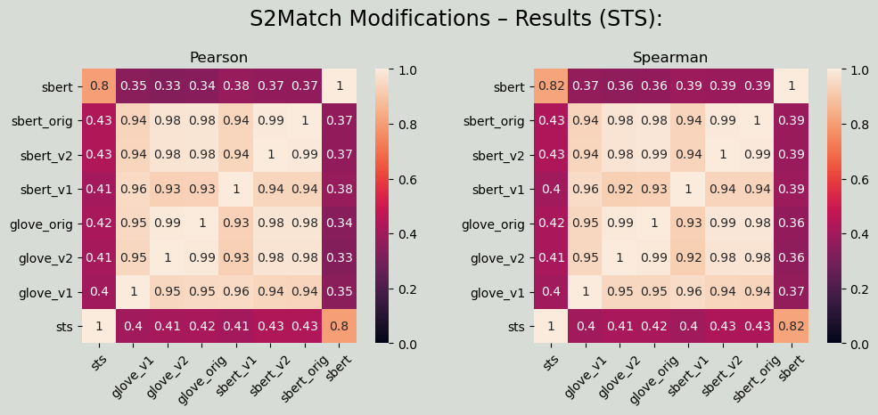

## Introduction:
#### Here is the official repositorium of our team's software project at the **Ruprecht Karl University of Heidelberg**.

Our goal is to extend one of the _AMR_ similarity metrics – $`S^2Match`$, which itself is an extension of **SMatch**.
$`S^2Match`$ makes use of _GloVe_-vectors to represent the semantics of concept nodes in _AMR_. This allows for a better triple comparison than it is possible in **SMatch** (because the latter assigns only 1 or 0 for triple similarity.)

Our extension to $`S^2Match`$ makes it possible not only to compare one triple with another, but also multiple triples from one AMR with one triple from another (gold), thus allowing for the representation of compositional similarity in _AMR_.

## Methods:
We have implemented 2 ways to achieve this goal.

1. **Merging**  
We found out that most of the compositionality is attributed to cases, in which phrase adjuncts are present. One of most frequent examples is: <br> <br>
$`NP = Det + (Adv) + Adj + N`$ (e.g. _'a very interesting proposition'_) <br> <br>
Such examples are commonly represented using _:mod_-relation in AMR. The idea is to transform an AMR graph in such a way that sentence tokens corresponding to all children nodes of A and A itself ($`= Subtree(A)`$) form a single concept node, which is then to substitute A. <br> $`Subtree(A)`$ is subject to the following conditions:<br>
    - Parent node X has a _:mod_-relation.
    - There are no nodes in $`Subtree(A)`$ (except A) that are used outside of $`Subtree(A) =>`$ has no reentrancies.
    - It corresponds to the complete token span in the sentence.
<br><br>
   **Examples:**  
      
* Conditions are fulfilled → transformation:
   

    
<sub> **Fig. 1:** AMR of _"Chinese lunar rover lands on moon"_ before transformation <endsub>  
        
  
<sub> **Fig. 2:** AMR of _"Chinese lunar rover lands on moon"_ after transformation <endsub>  

* Conditions are violated → no transformation:  


  
<sub> **Fig. 3:** AMR of _"What more can I do to improve my credit score?"_ got a reentrancy of MRPNode-5 <endsub>
 
 
  
<sub> **Fig. 4:** AMR of _"The final chapter in the trilogy, The Matrix Revolutions, is out in
  November"_ with incomplete span _"final chapter trilogy the matrix revolutions."_ <endsub>  
  
  

2. **Remapping** <br>
    One could argue that it may be undesirable to transform graphs in certain cases. To include an option, where this is not necessary we propose a series of steps:
    - Preprocessing graphs to obtain their alignment metadata.
    - Running $`S^2Match`$.
    - Postprocessing $`S^2Match`$ in a manner so that a node A in Graph 1 that is currently mapped to _Null_ be remapped according to its alignment metadata. <br> <br>

    These metadata allow us to see whether A has children nodes (similar to Method 1), which together compose a complete token span. We then compute similarity between this token span and a token span that corresponds to a node B in Graph 2.    
    $`sim(A, B)`$, which contributed to the F-Score gets accordingly updated, but only if $`sim_{updated}(A, B) > sim_{original}(A, B)`$. 
    This allows us to have better alignment results, because after the execution of _S2Match_ we apply a postprocessing technique in order to revise the mapping for the unmapped nodes.

## Tools:
### Root:
In the root directory you can find different scripts which follow the pipeline, which is presented below. For more information on how to combine all the scripts to do the magic, please consult our _Jupyter Notebook_  [`walkthrough.ipynb`](https://gitlab.com/denlogv/measuring-variation-in-amr/-/blob/master/walkthrough.ipynb). <br>
In order to run this pipeline you'll need to ensure that following criteria are met (it is unfortunate that one has to employ multiple vens to ensure multiple penman versions; alternatively, one could try to install one of the versions directly in the project folder and rename it):

| Script|Prerequisites|
|:----------:|:-------------:|
|`sts2tsv.py` or `sick2tsv.py`|`pandas`|
|`tsv2amr.py`|`amrlib`, `penman>=1.0`| 
|`amr_pipeline.py`|`penman==0.6.2`| <br>
### Pipeline:
1. Convert a corpus (a _.txt_-file with a SICK dataset or a folder with an STS dataset) to a _.tsv_ (tab-sepated values)-file. <br> <br> **Functionalities:** <br> <br>
    - `sts2tsv.py` converts a folder with STS-dataset to a single easily readable _.tsv_-file. <br> <br>
    - `sick2tsv.py` filters a file (_.txt_-file that has a tab-separated-values-layout with 12 columns) with a SICK-dataset to create a .tsv with columns "sent1", "sent2", "sick" (i.e. relatedness-score). <br> <br>
    In our experiments we filtered the dataset to exclude examples, where sentence pairs have entailment label 'CONTRADICTION'.
    ```
    Usage examples:

    python3 sick2tsv.py -i datasets/sick/SICK2014_full.txt -o data/SICK2014.tsv --entailment_exclude contradiction
    python3 sts2tsv.py -i datasets/sts/sts2016-english-with-gs-v1.0 -o data/STS2016_full.tsv
    ```
---
2. Use the created _.tsv_-file to generate 2 _AMR_-files (for each sentence column).  <br> <br>
**Functionalities:** <br> <br>
    - `tsv2amr.py` converts a _.tsv_-file to 2 _AMR_-files.
	```
    Usage example:
    
    python3 tsv2amr.py -i data/SICK2014.tsv -o data/amr/SICK2014_corpus
    ```
---    
3. Create alignment files for each _AMR_-file using the _AMR2Text_-alignment tool (TAMR/JAMR) presented in [**HIT-SCIR CoNLL2019 Unified Transition-Parser**](https://github.com/DreamerDeo/HIT-SCIR-CoNLL2019).<br> <br>
**Functionalities:** <br> <br>
    - `amr_pipeline.py`  <br> 1) converts .amr-files to MRP-format. <br> 2) runs the _AMR2Text_-alignment tool on the MRP-corpora.
	```
    Usage example:
    
    amr_pipeline.py -t AMR2Text -o data/amr/STS2016_corpus
    ```
---    
4. Analyse the alignment files and either transform the _AMR_-graphs according to **Method 1** or add metadata to them according to **Method 2**. <br> <br>
**Functionalities:** <br> <br>
    - `AMRAnalysis.py` takes 1 or 2 _AMR2Text_-alignment-files and either transforms the graphs, or adds metadata to these file. Outputs 1 or 2 _AMR_-files.
	```
    Usage example:
    
    python3 AMRAnalysis.py -i data/amr/SICK2014_corpus_a_aligned.mrp data/amr/SICK2014_corpus_b_aligned.mrp --output_prefix analysis/sick/SICK2014 --extended_meta
    ```
---    
5. Run $`S^2Match`$ on  the resulting _AMR_-files. Our modified scripts accept 3 kind of inputs without this needing to be explicitly specified: 
	- Original _AMR_-graphs without any modifications or transformations (associated files in `analysis/sick`, `analysis/sts` have the suffix **_reif.amr** because the graphs are reified – our algorithm needs it for extracting metadata, so we found it more "fair" to compare results, where all initial graphs were the same.)
	- Graphs, which contain alignment metadata in the typical _AMR_-format (e.g. _# ::labels_dict {"0": "MRPNode-0" ...}_). Associated files in `analysis/sick`, `analysis/sts` have the suffix **_reif_ext.amr**
	- Transformed graphs with all parent nodes that have a _:mod_-relation merged with their subtree (if there is a corresponding full token span and no reeintrancies.) Associated files in `analysis/sick`, `analysis/sts` have the suffix **_concat.amr** <br>
There are 2 relevant files in `amr_suite/py3-Smatch-and-S2match/smatch` that are our modified versions of the original $`S^2Match`$-code (all additions/changes are labeled **#SWP**):<br> <br>
**Functionalities:** <br><br>
	- `smatchdev_glove.py` uses GloVe-Embeddings
	- `smatchdev_sbert.py` uses [sentence-transformers](sbert.net)
	```
	Usage example:
	
	python3 amr_suite/py3-Smatch-and-S2match/smatch/s2matchdev_glove.py \
    -f analysis/sick/SICK2014_corpus_a_reif.amr analysis/sick/SICK2014_corpus_b_reif.amr \
    -vectors amr_suite/vectors/glove.6B.100d.txt \
    -diffsense 0.5 -cutoff 0.5 -v --ms \
    > analysis/sick/s2match_glove_results/SICK2014_orig_results_full.txt
	```	
---	
6. Evaluate by computing _Spearman rank_ and _Pearson correlation coefficients_ and visualising the results. <br> <br>
**Functionalities:** <br> <br>
	- `results2png` creates 2 heatmaps of the _Pearson/Spearman-correlation coefficients_ using either a _.tsv_-file, where all the necessary scores are available or using a _.tsv_-file and 2 folders (one for the $`S^2Match`$-results with the _GloVe_-Embeddings and another for the results using _SBERT_-models) 
	```
	Usage examples:
	
	python3 results2png.py --dataset STS --gold data/STS2016_full_fix.tsv \
    --smatch analysis/sts/s2match_glove_results analysis/sts/s2match_sbert_results \
    --output analysis/sts/s2match_modification_results.png 
       
	python3 results2png.py --dataset SICK --gold analysis/SICK2014_full_scores.tsv \
    --output analysis/sick/s2match_modification_results.png
	```	
<br> <br>
<sub> **Fig. 5:** Our results on SICK: <endsub>  
<sub> **Fig. 6:** Our results on STS: <endsub> 
---
### Folders:
We have been working with a lot of data, so we feel that a good overview would facilitate working with this repository. <br>
The file structure is as follows:
- `amr_suite` – folder with $`S^2Match`$, authored by Juri Opitz, Letitia Parcalabescu and Anette Frank, visit [**their**](https://github.com/Heidelberg-NLP/amr-metric-suite/) for more details. It contains our extensions to the existing codebase of $`S^2Match`$. You can find those extensions under `amr_suite/py3-Smatch-and-S2match/smatch/`. The relevant files are:
	- `s2matchdev_glove.py`,  
	- `s2matchdev_sbert.py`  <br><br>
- `AMR2Text` – our code is heavily dependent on the _AMR2Text_-alignment tool from the repo [**HIT-SCIR CoNLL2019 Unified Transition-Parser**](https://github.com/DreamerDeo/HIT-SCIR-CoNLL2019), visit their repo for installation details. <br><br>
- `datasets` – this folder contains all of the datasets in their original form, which we used for our experiments, namely: **SICK** and **STS**. We also have **MSRP** in there, but we haven't conducted any experiments on it.<br><br>
- `data` – this folder contains the datasets in the form, in which they are used later by our algorithms: _.tsv_-files, _AMR_-files:
	-  **_.amr_** – _original AMR-graphs-output format used by [**amrlib**](https://amrlib.readthedocs.io/)_, 
	- **_.mrp_, __aligned.mrp_** – _formats used by the AMR2Text-alignment tool_<br><br>
- `analysis` – this folder contains the output of `AMRAnalysis.py` (for 3 datasets, namely **SICK**, **STS** and a small corpus (~30 sentences) compiled mainly from STS-sentences and some sentences, which we added by hand to facilitate the testing)<br>
	All these data are used later by $`S^2Match`$, the outputs and the evaluation results of which are also there (**for our GloVe- and [SBERT](sbert.net)-extensions of  $`S^2Match`$**)<br><br>
- `papers` – this folder contains some papers, which were relevant to our work.<br><br>
- `presentation` – for those interested this folder contains the presentations held at **Ruprecht Karl University of Heidelberg**, where we presented our approach. Not relevant for the functionality of our tools.<br><br>
- `experiments` – during the development and testing phase we experimented a lot with different things and created *Jupyter Notebooks* for some scenarios. Not relevant for the functionality of our tools.
